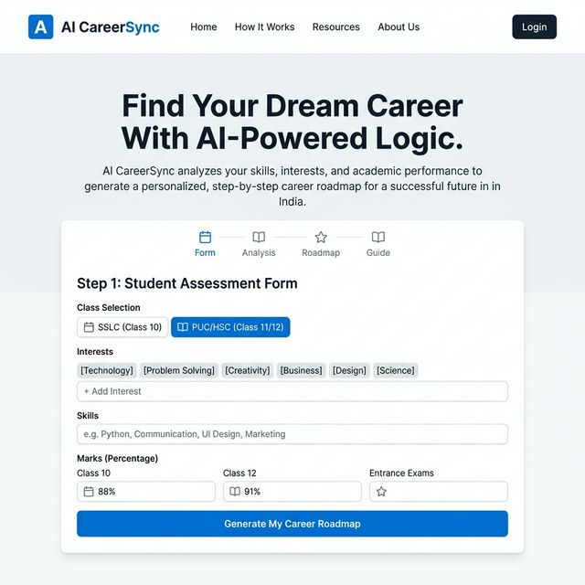

# 🚀 AI Career Roadmap Generator for Students

An AI-powered platform to help **SSLC (10th)** and **PUC (12th)** students navigate their career paths with precision.

## 📸 Preview



---

## ✨ Features
- **Student Profile Analysis**: Input Class, Interests, Skills, and Marks.
- **JWT Authentication**: Secure Signup/Login to save and track your roadmaps.
- **AI Career Suggestions**: 3 best-fit career options with detailed reasoning (powered by Qwen AI).
- **Interactive Roadmap**: Step-by-step guide with Courses, Skills, Timeline, and Exams.
- **Skill Gap Analysis**: Identify missing skills and how to bridge them.
- **History Dashboard**: View all your previously generated roadmaps.
- **Clean & Professional UI**: Minimalist, enterprise-grade design, mobile responsive.

---

## 🛠 Tech Stack
- **Frontend**: React (Vite), Tailwind CSS, Framer Motion, Lucide React.
- **Backend**: Node.js, Express.js, Sequelize (PostgreSQL).
- **Database**: PostgreSQL (Aiven Cloud) with SSL.
- **AI**: HuggingFace Inference SDK (`Qwen/Qwen2.5-7B-Instruct`).
- **Auth**: JWT (JSON Web Tokens) with bcrypt.

---

## ⚙️ Environment Variables

Create a `backend/.env` file:
```env
DATABASE_URL=postgres://avnadmin:<password>@pg-xxxxx.aivencloud.com:17873/defaultdb
PORT=5000
HF_API_KEY=your_huggingface_api_key
JWT_SECRET=your_jwt_secret
```

---

## 🚀 Running Locally

### Backend
```bash
cd backend
npm install
node server.js
```

### Frontend
```bash
cd frontend
npm install
npm run dev
```

---

## 💡 Sample Inputs for Testing

| Class | Interests | Skills | Marks | Expected Result |
|---|---|---|---|---|
| SSLC | Tech, Gadgets | Gaming | 85% | Software Engineer, Data Scientist, Hardware Tech |
| PUC | Medical, Biology | Empathy | 92% | Cardiologist, Biotech Researcher, Nurse |
| SSLC | Arts, Writing | Storytelling | 70% | Content Creator, Journalist, UX Designer |
| PUC | Business, Finance | Math | 80% | CA, Data Analyst, Entrepreneur |

---

Developed with ❤️ for future leaders.
